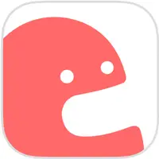
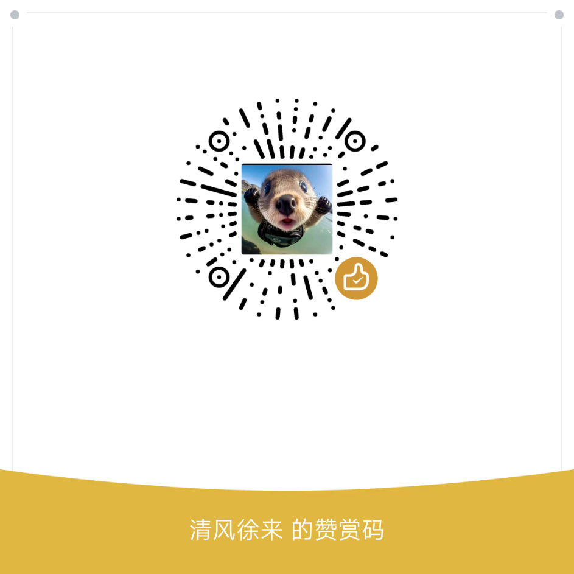

<div align="center">


# 纯粹直播 TV（Pure Live TV）

**基于 Flutter 的开源多平台直播聚合播放器 · 为电视与大屏而设计**

A third-party live stream aggregator built with Flutter, designed for Android TV.

[](https://github.com/liuchuancong/pure_live_TV/releases/latest)
[](https://github.com/liuchuancong/pure_live_TV/stargazers)
[](https://github.com/liuchuancong/pure_live_TV/releases)
[](LICENSE)
[](https://github.com/liuchuancong/pure_live_TV)
[](https://flutter.dev)

</div>

> **纯粹直播 TV** 是 [pure_live](https://github.com/liuchuancong/pure_live) 的电视版：只做一件事 —— 在电视上用遥控器舒服地看直播。全程无需触屏：方向键换台、OK 呼出控制栏、长按关注，支持 34 个直播平台与 IPTV 自定义源。

> 📺 **其他客户端 请迁移至：<https://github.com/liuchuancong/pure_live>**
---

## 📺 支持站点

**34 个直播站点 + IPTV 自定义直播源，共 35 个适配器。** 与移动版共用同一套平台层，各站分区、搜索、弹幕与人数口径保持一致。

### 🇨🇳 国内平台（18 站）

| | | |
| --- | --- | --- |
|  **哔哩哔哩** |  **斗鱼** |  **虎牙** |
|  **抖音** |  **快手** |  **YY 直播** |
|  **网易 CC** |  **AcFun** |  **猫耳 FM** |
|  **映客** |  **克拉克拉** |  **小红书** |
|  **微博直播** |  **京东直播** |  **酷狗直播** |
|  **百度直播** |  **六间房** |  **LOOK 直播** |

### 🌍 海外平台（16 站）

| | | |
| --- | --- | --- |
|  **Twitch** |  **SOOP Live** |  **YouTube Live** |
|  **TikTok LIVE** |  **Kick** |  **CHZZK** |
|  **Bigo Live** |  **17LIVE** |  **LiveMe** |
|  **SHOWROOM** |  **niconico** |  **Picarto** |
|  **TwitCasting** |  **FC2 Live** |  **Steam 直播** |
|  **PandaTV** | | |

### 📡 IPTV / 自定义直播源

- 支持 **M3U / M3U8** 网络与本地直播源导入
- 订阅源管理与自动同步，按分区、平台管理频道

---

## 📥 下载安装

前往 [**GitHub Releases**](https://github.com/liuchuancong/pure_live_TV/releases/latest) 获取最新安装包。

### 选择哪个 APK？

每个版本按 **CPU 架构（ABI）** 和 **渲染器** 提供 6 个安装包：

| 架构 | 适合设备 |
| --- | --- |
| `arm64-v8a` | 绝大多数电视 / 盒子（**优先选这个**） |
| `armeabi-v7a` | 老的 32 位盒子 |
| `x86_64` | 模拟器 |

| 渲染器 | 说明 |
| --- | --- |
| `-impeller` | 新渲染器，**推荐优先尝试** |
| `-skia` | 旧渲染器，画面异常 / 黑屏 / 文字发虚时改用此版 |

### 系统要求

| 平台 | 要求 |
| --- | --- |
| Android TV / 盒子 | **Android 7.0（API 24）及以上**，配套遥控器或空鼠 |
| Android 5.0 / 6.0 老盒子 | 请下载旧版 **v2.0.20**（本仓库 Release 列表内），新版不再支持 |

- 应用包名 `com.mystyle.purelive.tv`，使用固定签名，可直接覆盖升级。
- 首次安装需在系统设置中允许「安装未知应用」。
- **应用内在线更新**：设置 → 关于 → 在线更新，自动识别当前架构与渲染器，提供多条镜像加速下载；也可手动选择下载源。
- 下载后请核对 Release 页对应文件的 SHA256。

---

## ✨ 核心功能

### 🎬 多平台聚合

- 聚合 34 个直播平台，按平台与分区浏览；支持隐藏不常看的平台，节省加载
- 跨平台搜索，观看历史、热门推荐一键直达
- 关注列表支持 **标签分组**：给房间设置标签，按标签筛选、置顶排序；平台页签只显示真正有关注的平台

### 🎮 遥控器优先

- 全部界面为 D-pad 操作设计：方向键换台、OK 呼出底部控制栏、左右键双击关注
- 控制栏与侧边面板采用 **索引选择** 模型，高亮永远在遥控器手里，不存在"焦点找不到了"
- 底部控制栏：收藏、暂停、刷新、弹幕开关/设置/屏蔽、清晰度、线路、比例、纯音频、切换直播间、播放内核

### ▶️ 多播放器内核

设置中可随时切换播放内核，遇到黑屏、卡顿或硬解兼容问题时换一个即可：

- **MPV**（media_kit，默认）
- **FVP**（libmdk，自带新版 FFmpeg 与各平台硬解，用来兜住 MPV 放不了的老式封装，比如 codec-id-12 的 HEVC FLV）
- EXOPlayer
- IJKPlayer

切换内核自动重新获取播放地址，过期的流地址不会导致切换失败。

### 💬 弹幕系统

- 弹幕开关、透明度、字号、速度、显示区域、最大行数、描边、统一样式
- 关键词屏蔽与用户屏蔽独立管理，支持扫码后在手机网页端批量维护
- 两级重复过滤（精确 / 相似），切房不串台、不积压

### 🎧 纯音频 / 助眠

- 播放页底栏一键切换纯音频模式：不渲染画面、保留解码热状态，切回即时恢复画面
- 可配合定时关闭，适合睡觉前挂声音

### 📱 手机远程遥控

电视上扫码配对后，用手机浏览器即可：

- 遥控播放、管理弹幕屏蔽词与屏蔽用户
- 管理 B 站 / 抖音 / 斗鱼等平台 Cookie（仅存本机）
- 编辑标签、导入 IPTV 源、调整同步设置

### 💾 数据管理

- 本地备份 / 恢复，配置格式与 Windows 版互通
- 局域网同步：电视与手机 / 电脑互传关注、历史与设置
- 应用内在线更新，本地更新记录与版本历史

### 🖼️ 动态壁纸

首页支持静态与视频壁纸，自动随页面淡入淡出防残影；播放页进入时自动挂起，退出后恢复。

---

## 🛠 使用说明

### 🔑 Bilibili 高清直播

因平台限制，观看高清直播需登录。可在 **设置 → 账号** 中通过扫码或粘贴 Cookie 登录，凭据仅保存在本机，也可扫码后在手机端维护。

### 🖼️ 画面发虚 / 黑屏？

- 文字发虚、画面模糊但界面正常：先切换到 **Skia 渲染器** 版本验证是否为 Impeller 兼容问题
- 黑屏有声音：设置 → 播放器，切换播放内核
- 老设备卡顿：设置 → 通用，开启密集布局并降低弹幕数量

### 📥 导入 M3U 源

设置 → IPTV → 添加订阅源，支持网络地址与本地导入，可开启自动同步。

---

## ❓ 常见问题

| 问题 | 解决方案 |
| --- | --- |
| 安装提示解析包错误 | 选错了架构，电视盒子优先选 `arm64-v8a` |
| 提示"未安装"且无报错 | 系统低于 Android 7.0，请改用 v2.0.20 |
| 安装后被杀毒软件拦截 | 开源软件无签名白名单所致，自行斟酌后放行 |
| 播放黑屏 / 花屏 | 切换渲染器（Impeller ↔ Skia）或播放内核（MPV ↔ FVP ↔ EXO ↔ IJK） |
| 在线更新下载失败 | 更新页有多条镜像下载源，可手动切换；也可直接到 Releases 下载 |

---

## 🔒 声明与合规

- 本项目为 **非盈利性开源软件**，遵循 **[GPL-3.0 协议](LICENSE)**，仅用于个人学习与技术交流，请勿用于商业用途。
- **不提供任何 VIP 解锁、视频破解或盗链服务**。高清直播需您在对应平台拥有合法账号权限。
- 所有直播内容（视频、音频、图像等）**版权归属原平台所有**，本软件仅作技术聚合与播放展示。
- 本应用不收集任何用户隐私数据：所有请求均直接发往官方接口，无中间代理或数据中转；Cookie 仅用于本地身份认证，不会上传到任何服务器；无广告、无追踪。
- 若您认为本项目侵犯您的合法权益，请通过 [GitHub Issue](https://github.com/liuchuancong/pure_live_TV/issues) 联系，我们将及时处理。

---

## 🛠️ 本地构建

项目使用 Flutter `3.47.x`（stable）、AGP 9 与 Java 17 构建。克隆后依次执行：

```bash
flutter pub get

# Impeller 渲染器（默认推荐）
flutter build apk --release --flavor impeller --split-per-abi \
  --target-platform android-arm,android-arm64,android-x64

# Skia 渲染器（兼容模式）
flutter build apk --release --flavor skia --split-per-abi \
  --target-platform android-arm,android-arm64,android-x64
```

产物位于 `build/app/outputs/flutter-apk/`。推送 `v*` 标签会触发 GitHub Actions 自动构建并发布 Release。

---

## 🤝 贡献与致谢

**主开发者**：[@liuchuancong](https://github.com/liuchuancong)

**代码参考**

- [pure_live（Jackiu1997）](https://github.com/Jackiu1997/pure_live) —— 本项目的移动端上游，站点适配与功能设计大量参考
- [dart_simple_live](https://github.com/xiaoyaocz/dart_simple_live)
- [media_core](https://github.com/liuchuancong/media_core) —— 播放器内核封装

> 📌 欢迎贡献！站点适配、Bug 修复、文档改进均可提交 Issue 或 Pull Request。

---

## 🌟 Star 趋势

如果 Pure Live TV 对你有帮助，欢迎给项目一个 ⭐ Star：

## Star History

[](https://www.star-history.com/?repos=liuchuancong%2Fpure_live_tv&type=date&legend=top-left)

---

## ☕ 捐助支持

如果您觉得本项目对您有帮助，欢迎扫码支持开发者一杯咖啡 ☕

<p align="center">
  
</p>

> 您的支持是我持续维护的动力！感谢 ❤️
